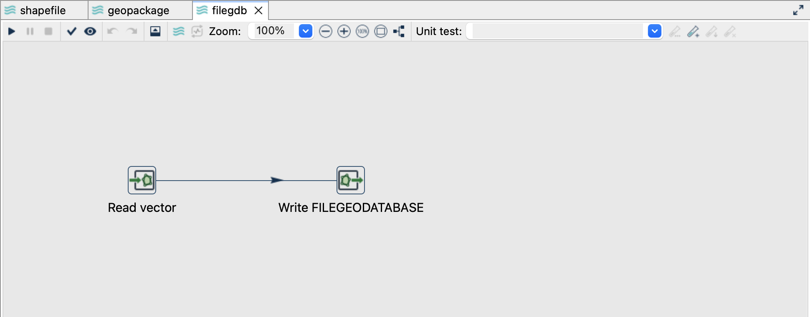
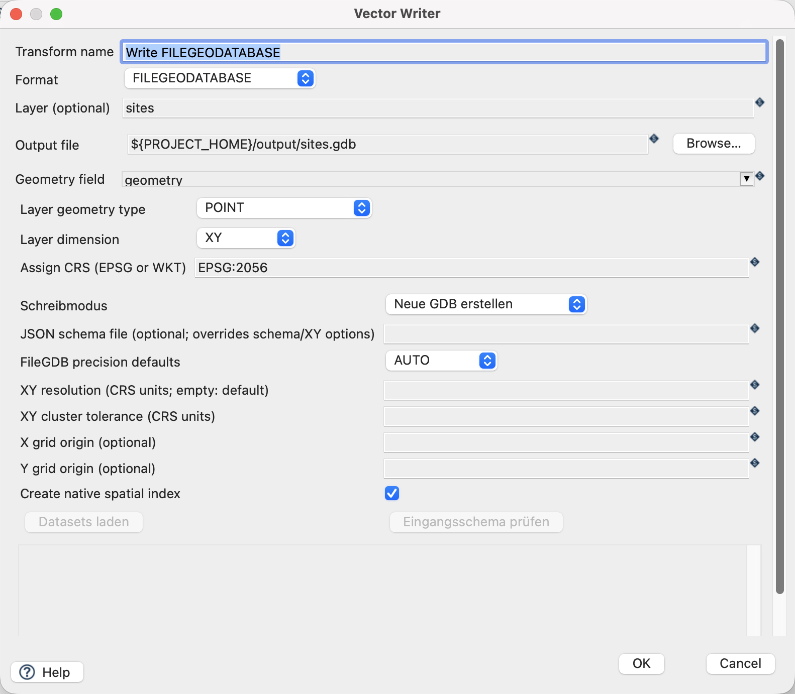
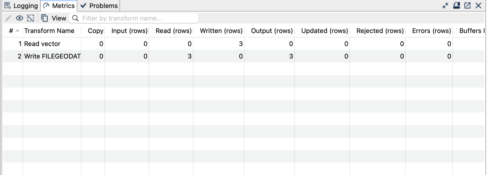

[All vector examples](../examples.qmd) · [Vector Raster plugin](../plugins.qmd#vector-raster)

Write the sample points to a new File Geodatabase, inspect the generated dataset, and read it back into a GeoPackage.

## Before you begin

[Download and set up the example project](../examples.qmd#set-up-the-example-project-once). This walkthrough uses Apache Hop ****, distribution ****, with the **local** run configuration. Keep the supplied input unchanged and use a writable `output` directory.

[Download filegdb.hpl](../downloads/vector-formats/filegdb.hpl) · [Complete project ZIP](../downloads/vector-formats.zip)

The individual pipeline requires the data and project configuration from the complete ZIP.

{fig-alt="The File Geodatabase pipeline in Hop GUI."}

## Read the source

1. Open **`filegdb.hpl`** from the example project.
2. Click **Read vector** and choose **Edit**. The file is `${PROJECT_HOME}/data/sites.gpkg`, format `AUTO`, layer `sites`, and geometry output field `geometry`.
3. Use the source schema/preview controls to inspect the fields. Expect `site_id`, `name`, `height_m` and a geometry field. The source contains three point features in EPSG:2056.
4. Close the reader dialog with **OK**, then click the writer and choose **Edit**.

{fig-alt="Vector Reader configured for the supplied GeoPackage layer."}

## Configure the writer

| Setting | Value |
|---|---|
| Format | `FILEGEODATABASE` |
| Output file | `${PROJECT_HOME}/output/sites.gdb` |
| Layer | `sites` |
| Geometry field | `geometry` |
| Assign CRS | `EPSG:2056` |
| Write mode (Schreibmodus) | Neue GDB erstellen (`CREATE_DATABASE`) |
| Precision mode | `AUTO` |
| Spatial index | `On` |

{fig-alt="Vector Writer settings for File Geodatabase."}

## Run and check the result

Run `filegdb.hpl` once. The output `sites.gdb` is a **directory** containing a dataset named `sites`, with three point features. Keep the entire directory together when copying it.

Open and run `read-filegdb.hpl`. Its reader points to `${PROJECT_HOME}/output/sites.gdb` and explicitly selects `sites`. The writer creates `output/filegdb-readback.gpkg`. Check three geometries, the original `site_id` values, the names and heights.

For projected EPSG:2056, `AUTO` precision uses a 0.0001 metre XY resolution and 0.001 metre tolerance. These fixture coordinates lie exactly on that grid. For real data, inspect the precision settings before expecting an exact roundtrip.

{fig-alt="Completed File Geodatabase pipeline with processing metrics."}

## Things to watch out for

- `OBJECTID` is generated as the geodatabase's row identifier; retain a separate business key such as `site_id`. A source attribute named `OBJECTID` is exported as `SOURCE_OBJECTID`, with collisions reported as errors.
- XY resolution/tolerance describe coordinate storage and processing precision. They are not a curve-approximation tolerance.
- FileGDB can preserve supported circular curves and Z/M, but this introductory dataset tests XY points only.
- The separate FileGDB Catalog Reader and FileGDB Writer cover domains, relationships and richer multi-dataset exports. This tutorial uses the generic Vector Reader/Writer.
- Use a new `.gdb` directory for a repeat, or remove only the generated `output/sites.gdb` directory first.

The CRS controls assign a coordinate reference system; they do not reproject coordinates. All coordinates in this example already use EPSG:2056.

## Further reading

- [Format reference (German)](https://edigonzales.github.io/hop-vector-raster-plugin/benutzerhandbuch/main/index.html#filegeodatabase)
- [Vector Writer settings (German)](https://edigonzales.github.io/hop-vector-raster-plugin/benutzerhandbuch/main/index.html#vector-writer)
- [Plugin source and additional examples](https://github.com/edigonzales/hop-vector-raster-plugin/tree/main/examples)
