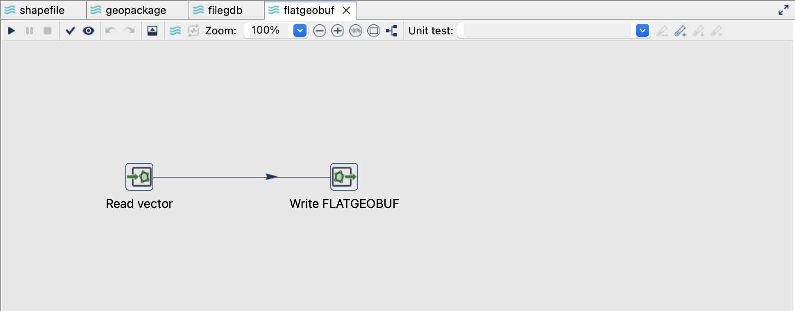
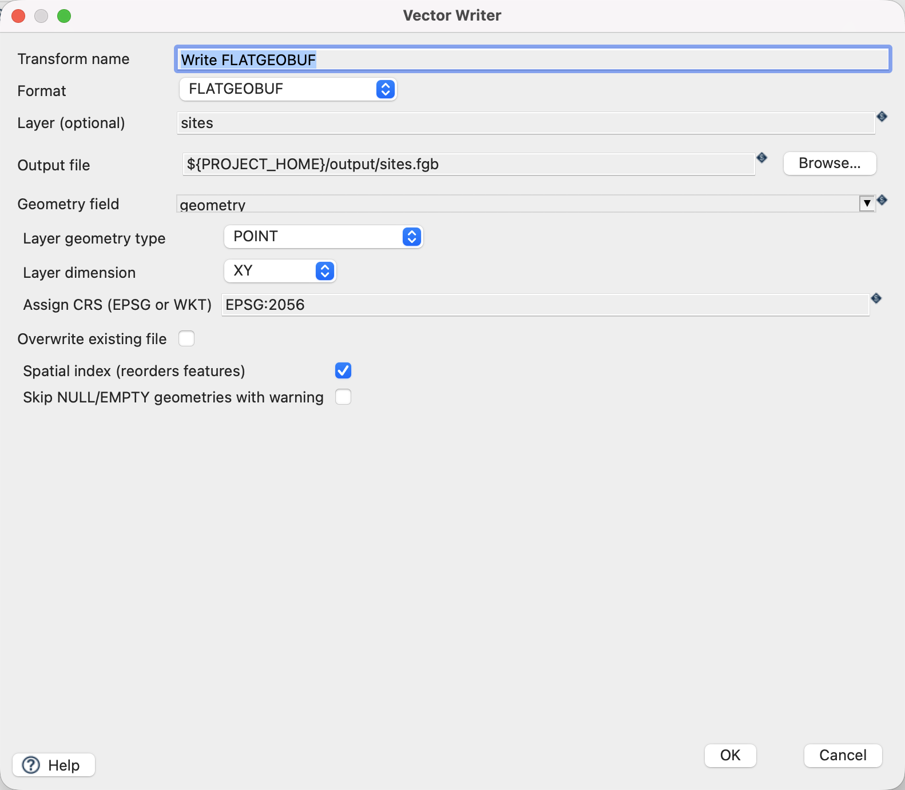
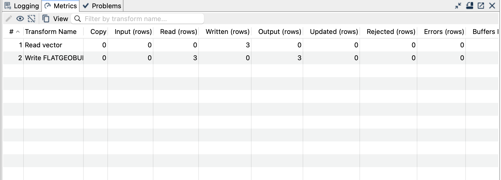

[All vector examples](../examples.qmd) · [Vector Raster plugin](../plugins.qmd#vector-raster)

Export the three sites into one indexed FlatGeobuf file for downstream tools that support the format.

## Before you begin

[Download and set up the example project](../examples.qmd#set-up-the-example-project-once). This walkthrough uses Apache Hop ****, distribution ****, with the **local** run configuration. Keep the supplied input unchanged and use a writable `output` directory.

[Download flatgeobuf.hpl](../downloads/vector-formats/flatgeobuf.hpl) · [Complete project ZIP](../downloads/vector-formats.zip)

The individual pipeline requires the data and project configuration from the complete ZIP.

{fig-alt="The FlatGeobuf pipeline in Hop GUI."}

## Read the source

1. Open **`flatgeobuf.hpl`** from the example project.
2. Click **Read vector** and choose **Edit**. The file is `${PROJECT_HOME}/data/sites.gpkg`, format `AUTO`, layer `sites`, and geometry output field `geometry`.
3. Use the source schema/preview controls to inspect the fields. Expect `site_id`, `name`, `height_m` and a geometry field. The source contains three point features in EPSG:2056.
4. Close the reader dialog with **OK**, then click the writer and choose **Edit**.

{fig-alt="Vector Reader configured for the supplied GeoPackage layer."}

## Configure the writer

| Setting | Value |
|---|---|
| Format | `FLATGEOBUF` |
| Output file | `${PROJECT_HOME}/output/sites.fgb` |
| Geometry field | `geometry` |
| Layer geometry type | `POINT` |
| Layer dimension | `XY` |
| Assign CRS | `EPSG:2056` |
| Spatial index (reorders features) | `On` |
| Skip NULL/EMPTY geometries with warning | `Off` |
| Overwrite existing file | `Off` |

{fig-alt="Vector Writer settings for FlatGeobuf."}

## Run and check the result

Save and run `flatgeobuf.hpl`. Expect one `.fgb` file containing three XY point features with all three attributes. Check the result by matching `site_id`, rather than comparing row positions: the spatial index can reorder features.

Open the output in a FlatGeobuf-capable GIS or inspect it with `ogrinfo -al output/sites.fgb` if GDAL is installed. GDAL is an optional independent checker; it is not required by GeoHop. Vector Reader cannot read this format in the documented distribution.

{fig-alt="Completed FlatGeobuf pipeline with processing metrics."}

## Things to watch out for

- Indexed output rejects NULL/EMPTY geometries by default. Turning on the skip option drops those rows with a warning; reconcile the output count if you choose it.
- Disabling the spatial index preserves input order. Index creation can require substantial memory and temporary disk space for larger datasets.
- Select an explicit geometry type and dimension for empty input instead of depending on schema inference.
- Supported curve inputs are linearized for this output. The tutorial's plain XY points do not exercise curve or Z/M behaviour.
- Do not connect this file to Vector Reader for a roundtrip: this format is output-only here.

The CRS controls assign a coordinate reference system; they do not reproject coordinates. All coordinates in this example already use EPSG:2056.

## Further reading

- [Format reference (German)](https://edigonzales.github.io/hop-vector-raster-plugin/benutzerhandbuch/main/index.html#flatgeobuf)
- [Vector Writer settings (German)](https://edigonzales.github.io/hop-vector-raster-plugin/benutzerhandbuch/main/index.html#vector-writer)
- [Plugin source and additional examples](https://github.com/edigonzales/hop-vector-raster-plugin/tree/main/examples)
