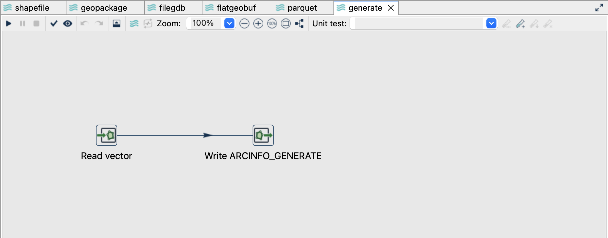
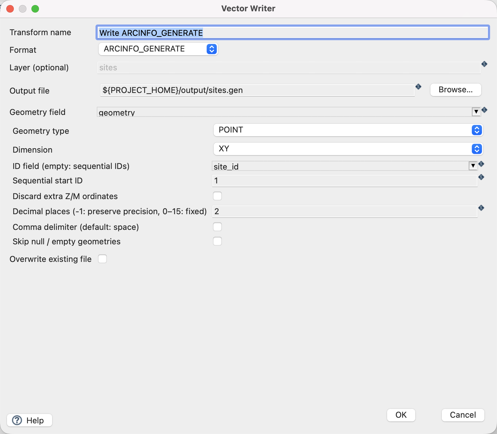
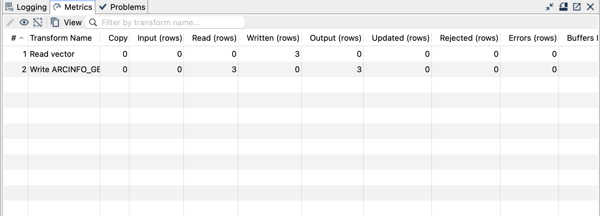

[All vector examples](../examples.qmd) · [Vector Raster plugin](../plugins.qmd#vector-raster)

Write the three site IDs and their coordinates to a small, human-readable GENERATE file.

## Before you begin

[Download and set up the example project](../examples.qmd#set-up-the-example-project-once). This walkthrough uses Apache Hop ****, distribution ****, with the **local** run configuration. Keep the supplied input unchanged and use a writable `output` directory.

[Download generate.hpl](../downloads/vector-formats/generate.hpl) · [Complete project ZIP](../downloads/vector-formats.zip)

The individual pipeline requires the data and project configuration from the complete ZIP.

{fig-alt="The ArcInfo GENERATE pipeline in Hop GUI."}

## Read the source

1. Open **`generate.hpl`** from the example project.
2. Click **Read vector** and choose **Edit**. The file is `${PROJECT_HOME}/data/sites.gpkg`, format `AUTO`, layer `sites`, and geometry output field `geometry`.
3. Use the source schema/preview controls to inspect the fields. Expect `site_id`, `name`, `height_m` and a geometry field. The source contains three point features in EPSG:2056.
4. Close the reader dialog with **OK**, then click the writer and choose **Edit**.

{fig-alt="Vector Reader configured for the supplied GeoPackage layer."}

## Configure the writer

| Setting | Value |
|---|---|
| Format | `ARCINFO_GENERATE` |
| Output file | `${PROJECT_HOME}/output/sites.gen` |
| Geometry field | `geometry` |
| Geometry type | `POINT` |
| Dimension | `XY` |
| ID field | `site_id` |
| Decimal places | `2` |
| Comma separator | `Off` |
| Skip empty | `Off` |
| Overwrite existing file | `Off` |

{fig-alt="Vector Writer settings for ArcInfo GENERATE."}

## Run and check the result

Run `generate.hpl`, then open the output with a text editor. The complete expected result is:

```text
1 2600000.00 1200000.00
2 2600100.00 1200050.00
3 2600200.00 1200100.00
END
```

Each line is `ID X Y`. The final `END` terminates the file. There is no attribute table: `name` and `height_m` are intentionally absent. Document **EPSG:2056** alongside the exported file because GENERATE does not embed CRS metadata.

{fig-alt="Completed ArcInfo GENERATE pipeline with processing metrics."}

## Things to watch out for

- The ID field must be an integer. Without one, generated IDs begin at the configured start value; uniqueness is not checked automatically.
- Point, line and polygon dialects differ. Ensure the receiving tool expects the selected dialect; not every `.gen` importer accepts every variant.
- Only simple homogeneous geometries are supported. Multipart geometries, collections, curves and polygon holes need appropriate upstream processing.
- XY and XYZ are different output modes. A numeric height attribute does not make an XY geometry an XYZ geometry.
- Rounding can change geometry. This example rounds to two decimals without changing its integer coordinates; use appropriate precision for real data.
- Arbitrary attributes and CRS are not embedded. Vector Reader cannot read GENERATE output.

The CRS controls assign a coordinate reference system; they do not reproject coordinates. All coordinates in this example already use EPSG:2056.

## Further reading

- [Format reference (German)](https://edigonzales.github.io/hop-vector-raster-plugin/benutzerhandbuch/main/index.html#generate)
- [Vector Writer settings (German)](https://edigonzales.github.io/hop-vector-raster-plugin/benutzerhandbuch/main/index.html#vector-writer)
- [Plugin source and additional examples](https://github.com/edigonzales/hop-vector-raster-plugin/tree/main/examples)
