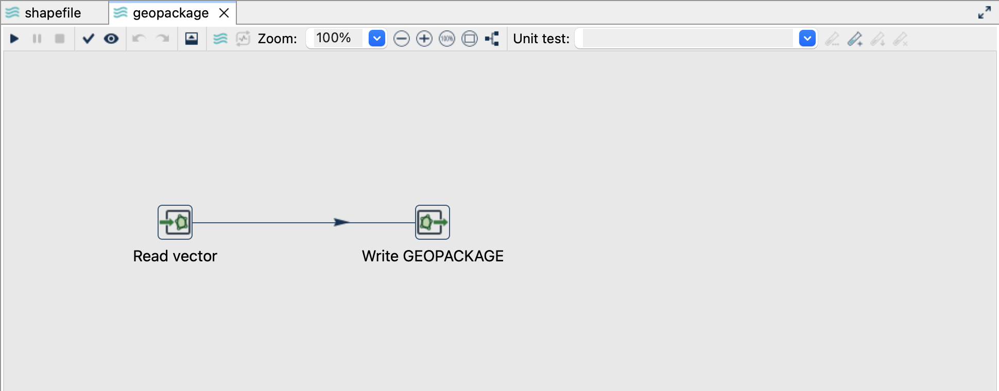
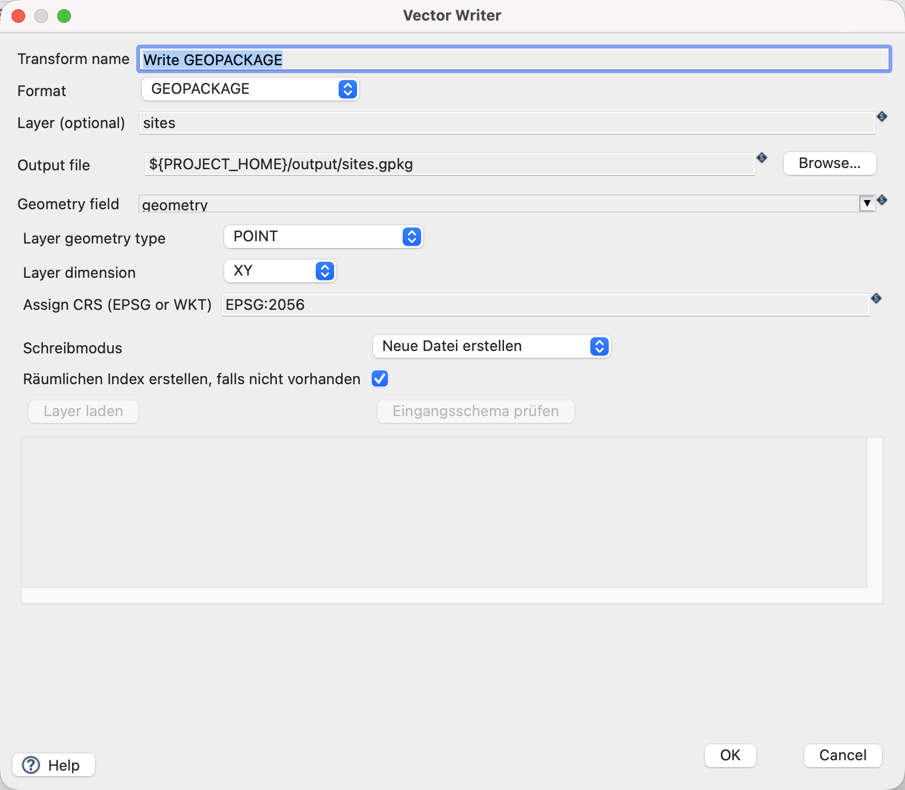
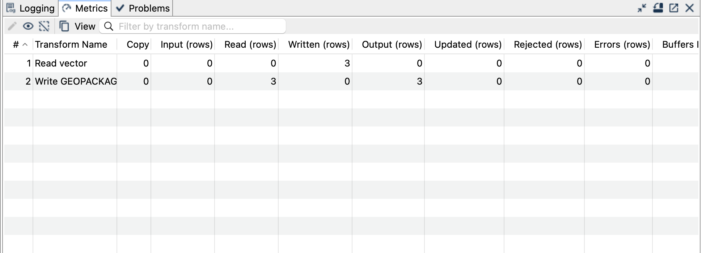

[All vector examples](../examples.qmd) · [Vector Raster plugin](../plugins.qmd#vector-raster)

Create a GeoPackage from the supplied sites, then distinguish adding a new layer from appending more features to an existing layer.

## Before you begin

[Download and set up the example project](../examples.qmd#set-up-the-example-project-once). This walkthrough uses Apache Hop ****, distribution ****, with the **local** run configuration. Keep the supplied input unchanged and use a writable `output` directory.

[Download geopackage.hpl](../downloads/vector-formats/geopackage.hpl) · [Complete project ZIP](../downloads/vector-formats.zip)

The individual pipeline requires the data and project configuration from the complete ZIP.

{fig-alt="The GeoPackage pipeline in Hop GUI."}

## Read the source

1. Open **`geopackage.hpl`** from the example project.
2. Click **Read vector** and choose **Edit**. The file is `${PROJECT_HOME}/data/sites.gpkg`, format `AUTO`, layer `sites`, and geometry output field `geometry`.
3. Use the source schema/preview controls to inspect the fields. Expect `site_id`, `name`, `height_m` and a geometry field. The source contains three point features in EPSG:2056.
4. Close the reader dialog with **OK**, then click the writer and choose **Edit**.

{fig-alt="Vector Reader configured for the supplied GeoPackage layer."}

## Configure the writer

| Setting | Value |
|---|---|
| Format | `GEOPACKAGE` |
| Output file | `${PROJECT_HOME}/output/sites.gpkg` |
| Layer | `sites` |
| Geometry field | `geometry` |
| Assign CRS | `EPSG:2056` |
| Write mode (Schreibmodus) | Neue Datei erstellen (`CREATE_FILE`) |
| Create spatial index | `On` |

{fig-alt="Vector Writer settings for GeoPackage."}

## Run and check the result

Run `geopackage.hpl` once. Expect a new GeoPackage with a `sites` layer containing three points.

### Add a second layer

Open `geopackage-add-layer.hpl`. It uses the same input and output file, but the writer's layer is **`sites_copy`** and its mode is **Neuen Layer hinzufügen (`ADD_LAYER`)**. Run once: the file now contains two layers, each with three features. The original `sites` layer remains intact.

### Append to an existing layer

Open `geopackage-append.hpl`. The writer targets **`sites`** with **Features hinzufügen (`APPEND_FEATURES`)**. Run once: `sites` now has **six** features, while `sites_copy` still has **three**. Each original `site_id` occurs twice in `sites`; this example intentionally appends duplicates. It is not an update or upsert.

Use Vector Reader to open the output GeoPackage and explicitly select each layer when inspecting the result.

{fig-alt="Completed GeoPackage pipeline with processing metrics."}

## Things to watch out for

- `CREATE_FILE` requires a new file; `ADD_LAYER` requires a new layer name; `APPEND_FEATURES` requires a compatible existing target layer.
- GeoPackage uses its own write modes. The generic overwrite checkbox does not replace an existing GeoPackage.
- Every repeat of the append pipeline adds another three rows. Start from a fresh output file when reproducing the stated counts.
- This plugin's GeoPackage vector output is XY. Do not silently discard Z/M from real source data.
- Geometry inference needs a non-NULL geometry. Check empty or entirely NULL source streams separately.

The CRS controls assign a coordinate reference system; they do not reproject coordinates. All coordinates in this example already use EPSG:2056.

## Further reading

- [Format reference (German)](https://edigonzales.github.io/hop-vector-raster-plugin/benutzerhandbuch/main/index.html#geopackage)
- [Vector Writer settings (German)](https://edigonzales.github.io/hop-vector-raster-plugin/benutzerhandbuch/main/index.html#vector-writer)
- [Plugin source and additional examples](https://github.com/edigonzales/hop-vector-raster-plugin/tree/main/examples)
