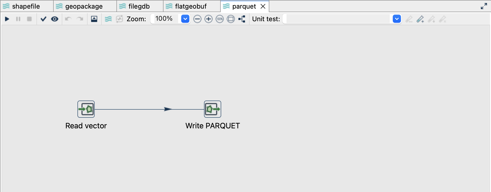
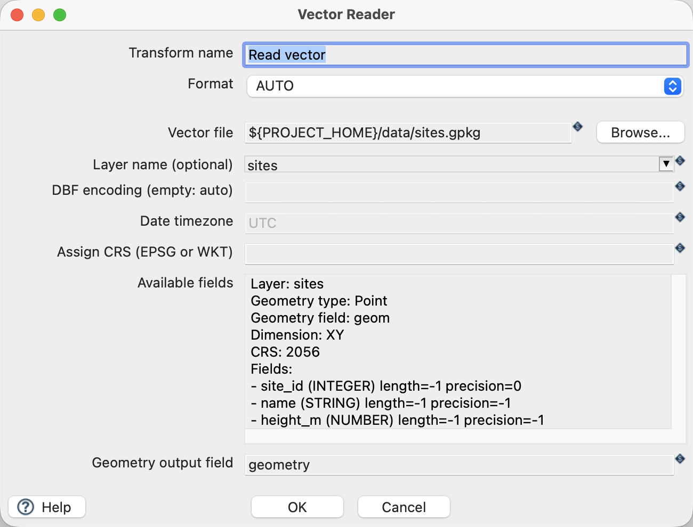
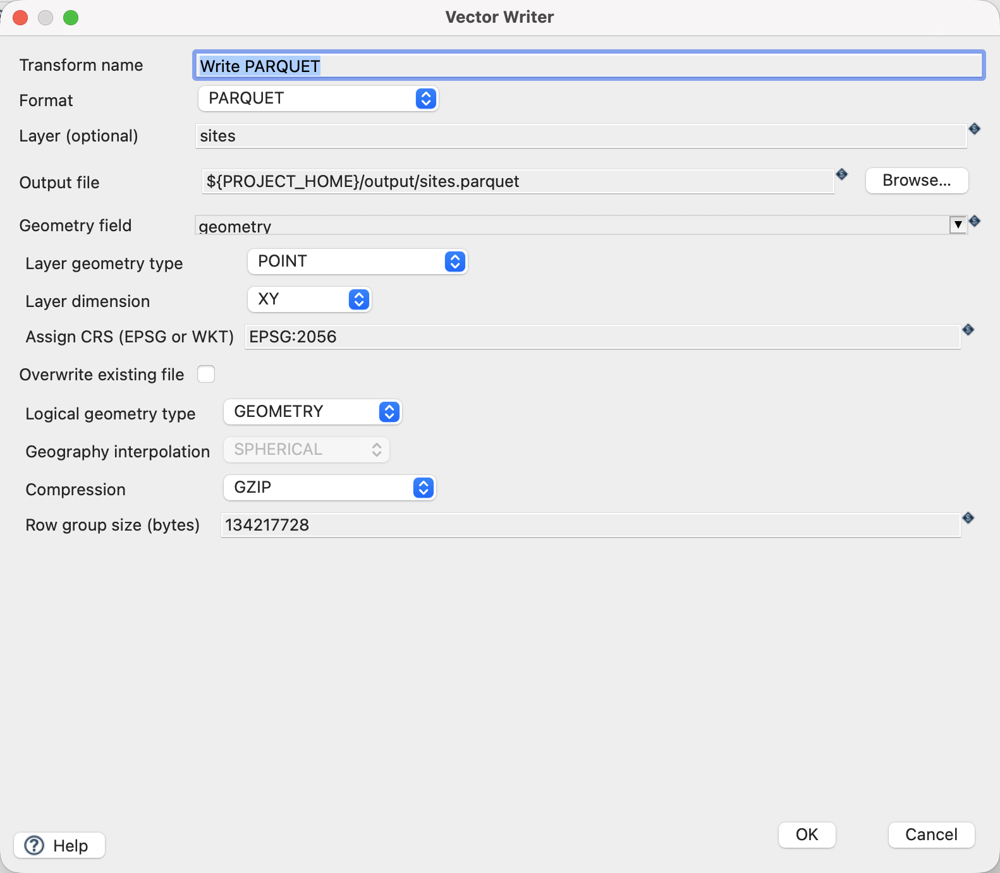
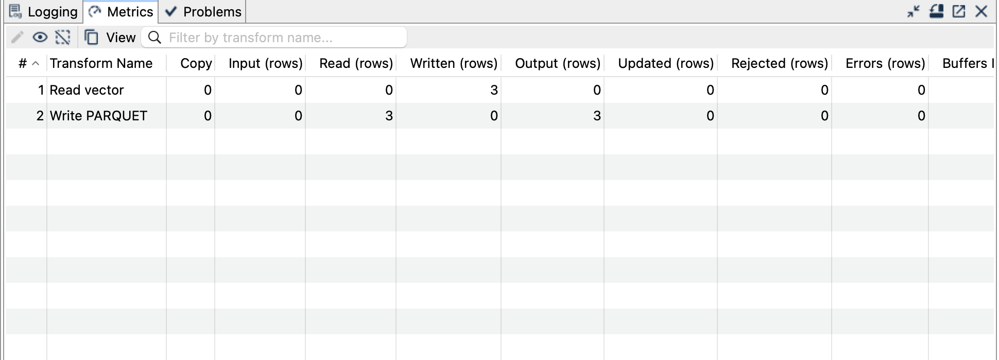

[All vector examples](../examples.qmd) · [Vector Raster plugin](../plugins.qmd#vector-raster)

Write a compact columnar dataset with typed attributes and a native Parquet GEOMETRY logical type.

## Before you begin

[Download and set up the example project](../examples.qmd#set-up-the-example-project-once). This walkthrough uses Apache Hop ****, distribution ****, with the **local** run configuration. Keep the supplied input unchanged and use a writable `output` directory.

[Download parquet.hpl](../downloads/vector-formats/parquet.hpl) · [Complete project ZIP](../downloads/vector-formats.zip)

The individual pipeline requires the data and project configuration from the complete ZIP.

{fig-alt="The Native spatial Parquet pipeline in Hop GUI."}

## Read the source

1. Open **`parquet.hpl`** from the example project.
2. Click **Read vector** and choose **Edit**. The file is `${PROJECT_HOME}/data/sites.gpkg`, format `AUTO`, layer `sites`, and geometry output field `geometry`.
3. Use the source schema/preview controls to inspect the fields. Expect `site_id`, `name`, `height_m` and a geometry field. The source contains three point features in EPSG:2056.
4. Close the reader dialog with **OK**, then click the writer and choose **Edit**.

{fig-alt="Vector Reader configured for the supplied GeoPackage layer."}

## Configure the writer

| Setting | Value |
|---|---|
| Format | `PARQUET` |
| Output file | `${PROJECT_HOME}/output/sites.parquet` |
| Geometry field | `geometry` |
| Layer geometry type | `POINT` |
| Layer dimension | `XY` |
| Assign CRS | `EPSG:2056` |
| Logical geometry type | `GEOMETRY` |
| Compression | `GZIP` |
| Row group size (bytes) | `134217728` |
| Overwrite existing file | `Off` |

{fig-alt="Vector Writer settings for Native spatial Parquet."}

## Run and check the result

Run `parquet.hpl`. Expect three records with `site_id`, `name`, `height_m` and a geometry column. `height_m` remains a floating-point attribute; it is not encoded as a coordinate dimension.

Inspect with a reader that understands native Parquet spatial logical types. The published example was independently read with GDAL 3.13.3: it reports three geometries in EPSG:2056 and the expected attributes. A generic Parquet reader may expose the geometry bytes without spatial interpretation.

Use **GEOMETRY** for these projected coordinates. **GEOGRAPHY** has different geographic semantics and interpolation settings; selecting it does not convert LV95 coordinates to longitude and latitude.

{fig-alt="Completed Native spatial Parquet pipeline with processing metrics."}

## Things to watch out for

- This is **native spatial Parquet**, not a file with GeoParquet `geo` metadata. Check downstream support explicitly rather than assuming all GeoParquet readers accept it.
- Geometry schema and dimension must match the data. Supported curves are linearized.
- Decimal fields need valid precision/scale metadata; this fixture uses ordinary numeric values and does not test decimal edge cases.
- Row-group size is a tuning setting, not a limit on total output size.
- Vector Reader cannot read this Parquet output. Use an independent reader for verification.

The CRS controls assign a coordinate reference system; they do not reproject coordinates. All coordinates in this example already use EPSG:2056.

## Further reading

- [Format reference (German)](https://edigonzales.github.io/hop-vector-raster-plugin/benutzerhandbuch/main/index.html#parquet)
- [Vector Writer settings (German)](https://edigonzales.github.io/hop-vector-raster-plugin/benutzerhandbuch/main/index.html#vector-writer)
- [Plugin source and additional examples](https://github.com/edigonzales/hop-vector-raster-plugin/tree/main/examples)
