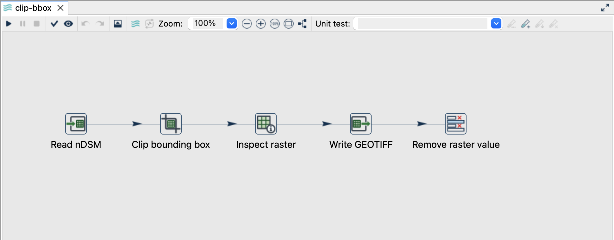
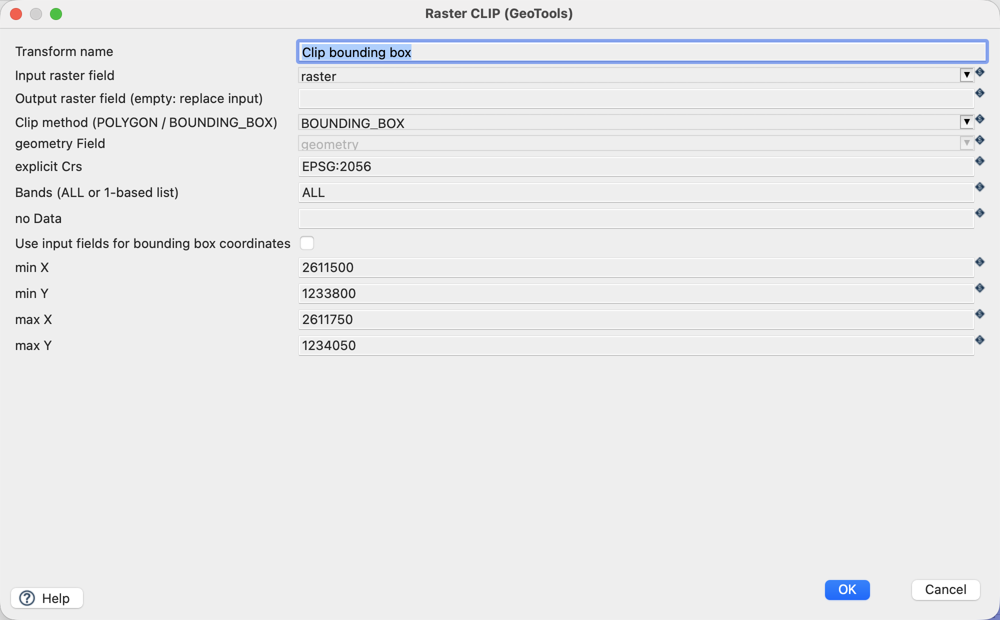
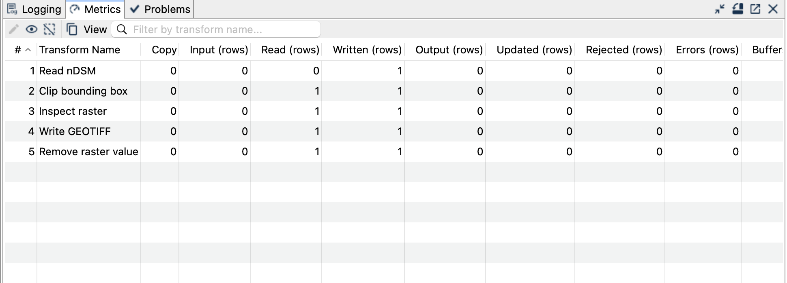
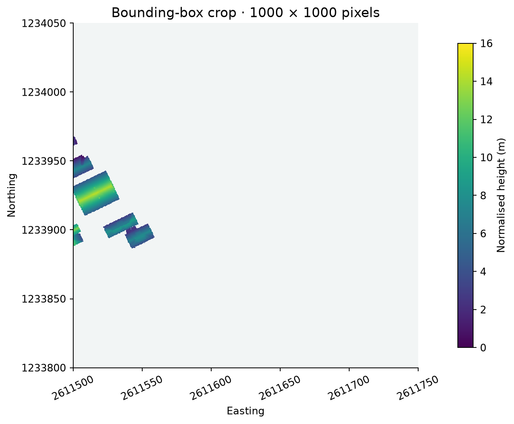

[All raster tutorials](raster-processing.qmd) · [Vector Raster plugin](../plugins.qmd#vector-raster)

Extract a 250 × 250 metre square while retaining the original 0.25-metre cell grid.

## Before you begin

[Set up the complete raster project](raster-processing.qmd#set-up-the-example-project-once). Tested on **3 October 2026**, Apache Hop **2.19.0**, Java **21.0.10**, with the plugin builds recorded in the ZIP's `tested-environment.json`. Use the **local** run configuration.

[Download clip-bbox.hpl](../downloads/raster-processing/clip-bbox.hpl)

[Complete project ZIP](../downloads/raster-processing.zip). Individual pipelines need the data and metadata from that ZIP.

{fig-alt="Bounding-box clipping pipeline."}

## Configure the clip

1. Open `clip-bbox.hpl`. **Read nDSM** uses the bundled `${PROJECT_HOME}/data/ndsm-2019.tif`.
2. Click **Clip bounding box → Edit** and use the settings below.
3. Leave the output raster field empty to replace the input `raster` value. **Inspect raster** describes the derived crop; **Write GEOTIFF** materialises it.

| Setting | Value |
|---|---|
| Input raster / clip method | `raster` / `BOUNDING_BOX` |
| Explicit CRS | `EPSG:2056` |
| min X / min Y | `2611500` / `1233800` |
| max X / max Y | `2611750` / `1234050` |
| Bands | `ALL` |
| NoData override | Empty: inherit the source |
| Writer path | `${PROJECT_HOME}/output/clip-bbox.tif` |

{fig-alt="Raster Clip with explicit bounding-box coordinates."}

## Run and check

Expect one output file with **1000 × 1000 pixels** in EPSG:2056. Its extent is exactly the specified box, its pixel size remains 0.25 m, and its samples match the corresponding source window. NoData stays `-9999`.

{fig-alt="Successful bounding-box clipping run."}
{fig-alt="The actual 250-metre output crop."}

## Things to watch out for

- Box coordinates belong to the explicit CRS, not to an assumed screen/map CRS.
- Clip preserves the source grid. A box not aligned to pixel edges can produce an extent rounded to overlapping source cells.
- Clip does not write a file; connect a Writer or another raster consumer.
- A crop can contain mostly NoData. Check the valid samples as well as its dimensions.
- The sample output already exists after one run; choose a new filename or remove it before rerunning.

## Further reading

- [Relevant handbook section (German)](https://edigonzales.github.io/hop-vector-raster-plugin/benutzerhandbuch/main/index.html#raster-clip-dialog)
- [Plugin and repository examples](https://github.com/edigonzales/hop-vector-raster-plugin/tree/main/examples)
