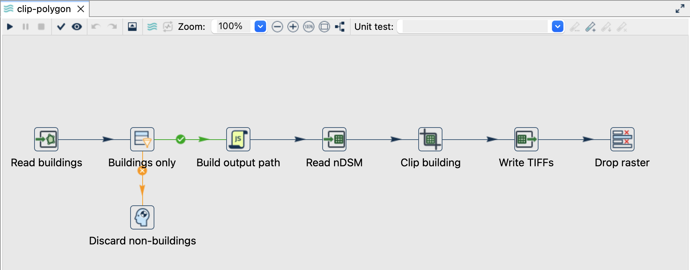
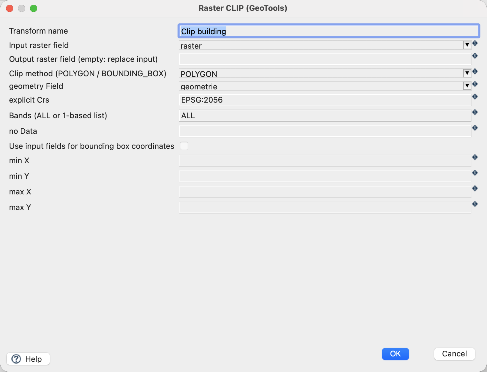
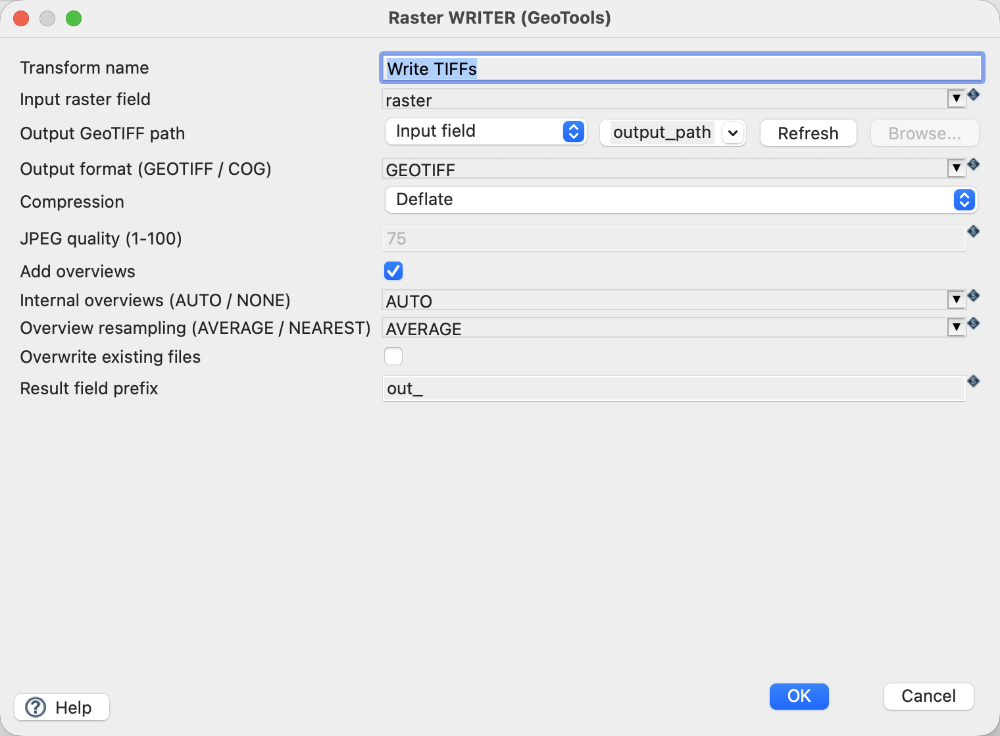
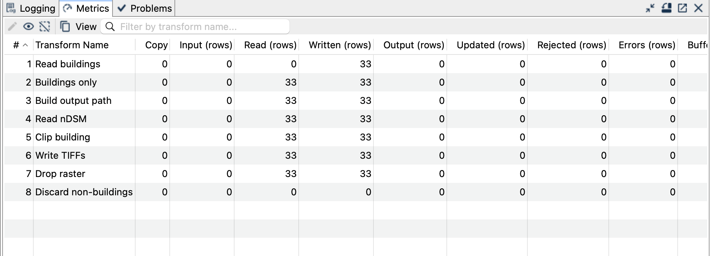
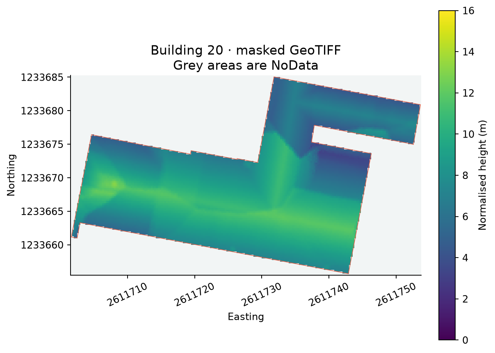

[All raster tutorials](raster-processing.qmd) · [Vector Raster plugin](../plugins.qmd#vector-raster)

Create one masked GeoTIFF for each of the 33 building footprints. No other land-cover categories are processed.

## Before you begin

[Set up the complete raster project](raster-processing.qmd#set-up-the-example-project-once). Tested on **3 October 2026**, Apache Hop **2.19.0**, Java **21.0.10**, with the plugin builds recorded in the ZIP's `tested-environment.json`. Use the **local** run configuration.

[Download clip-polygon.hpl](../downloads/raster-processing/clip-polygon.hpl)

[Complete project ZIP](../downloads/raster-processing.zip). Individual pipelines need the data and metadata from that ZIP.

{fig-alt="One masked output raster per building."}

## Read buildings and create unique paths

1. Open `clip-polygon.hpl`. **Read buildings** reads `data/buildings.gpkg`, layer `buildings`, geometry field `geometrie`.
2. **Buildings only** additionally checks `art_txt = Gebaeude`. Its false branch explicitly discards other rows.
3. **Build output path** creates `${PROJECT_HOME}/output/building-<building_id>.tif`. `building_id` is the original source primary key exposed as a regular attribute.
4. **Read nDSM** adds the same local raster source to every building row.

## Configure Clip and Writer

| Setting | Value |
|---|---|
| Clip input raster / output raster | `raster` / empty (replace) |
| Clip method | `POLYGON` |
| Geometry field / explicit CRS | `geometrie` / `EPSG:2056` |
| Bands / NoData override | `ALL` / empty |
| Writer output mode / field | `Input field` / `output_path` |
| Format / compression | `GEOTIFF` / `Deflate` |
| Overwrite | Off |

{fig-alt="Polygon Clip uses only the building geometry."}
{fig-alt="Raster Writer takes a different output path from each row."}

## Run and check

Expect **33 TIFFs**, each in EPSG:2056 on the original 0.25-metre grid. The rectangular file extent encloses the building; cells outside its polygon are masked as NoData. Source values inside the mask remain unchanged. Buildings without valid source pixels still produce a masked raster with no valid height samples.

{fig-alt="Successful processing of all 33 building rows."}
{fig-alt="An actual clipped building raster with the footprint outline."}

## Things to watch out for

- A fixed output filename would collide across rows. Use the `output_path` field and keep one Writer copy.
- Polygon masking and the raster's rectangular bounds are different: an output TIFF is not a polygon-shaped file.
- Polygon holes stay masked; invalid geometries must be repaired upstream.
- NoData does not mean zero metres. A zero sample remains valid.
- To repeat the complete example, remove only the generated `building-*.tif` files or choose a fresh output directory.

## Further reading

- [Relevant handbook section (German)](https://edigonzales.github.io/hop-vector-raster-plugin/benutzerhandbuch/main/index.html#raster-clip-dialog)
- [Plugin and repository examples](https://github.com/edigonzales/hop-vector-raster-plugin/tree/main/examples)
