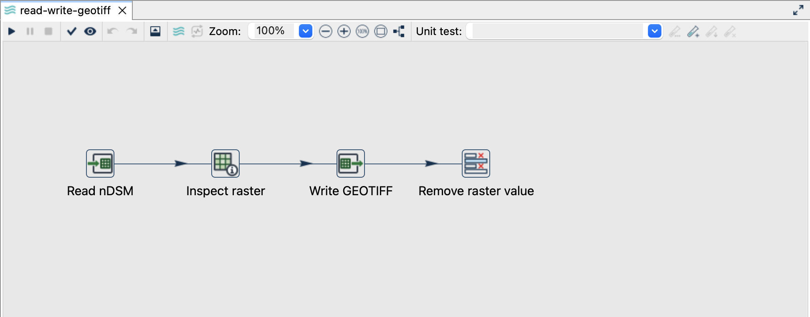
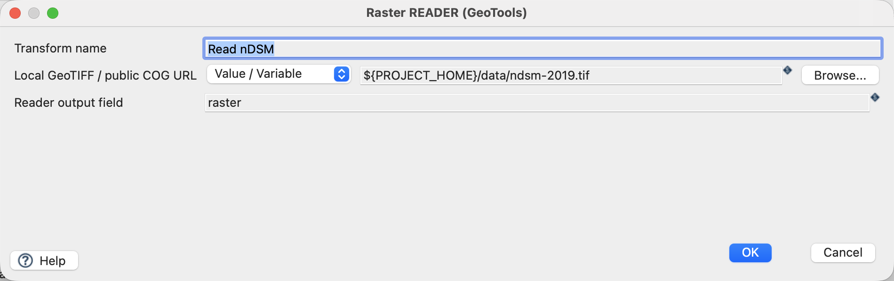
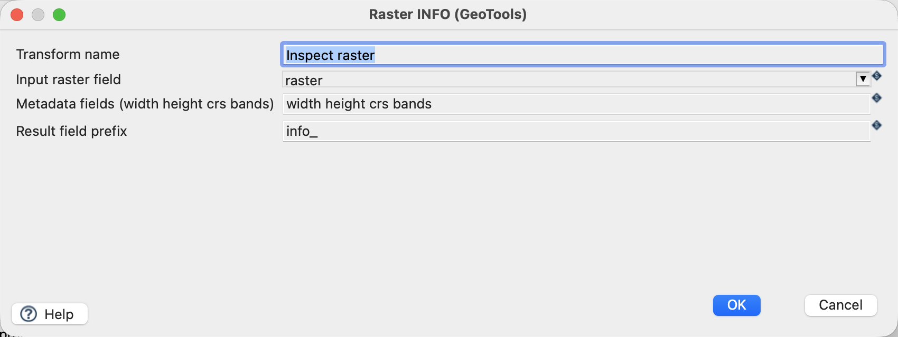
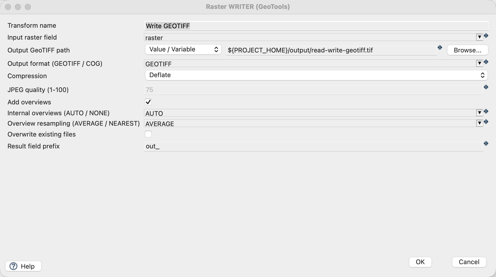
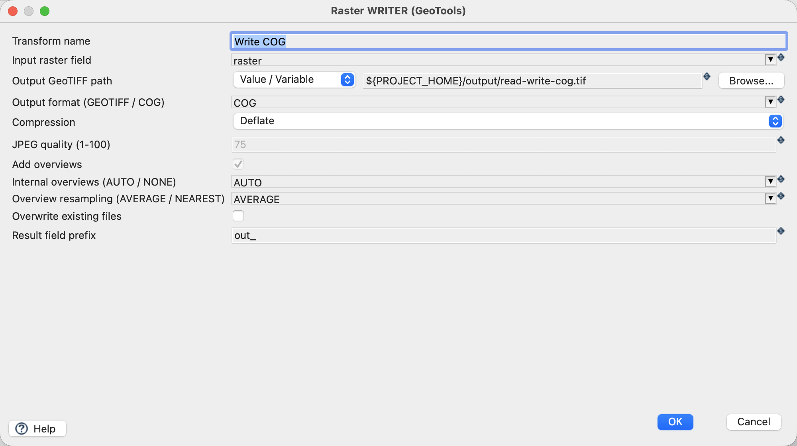
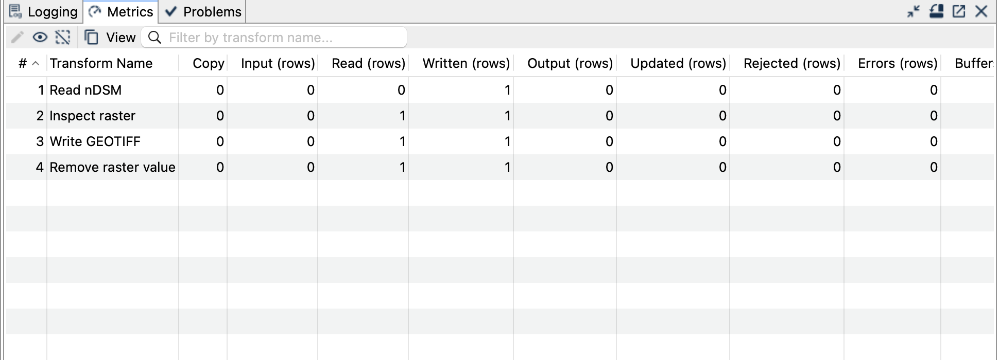
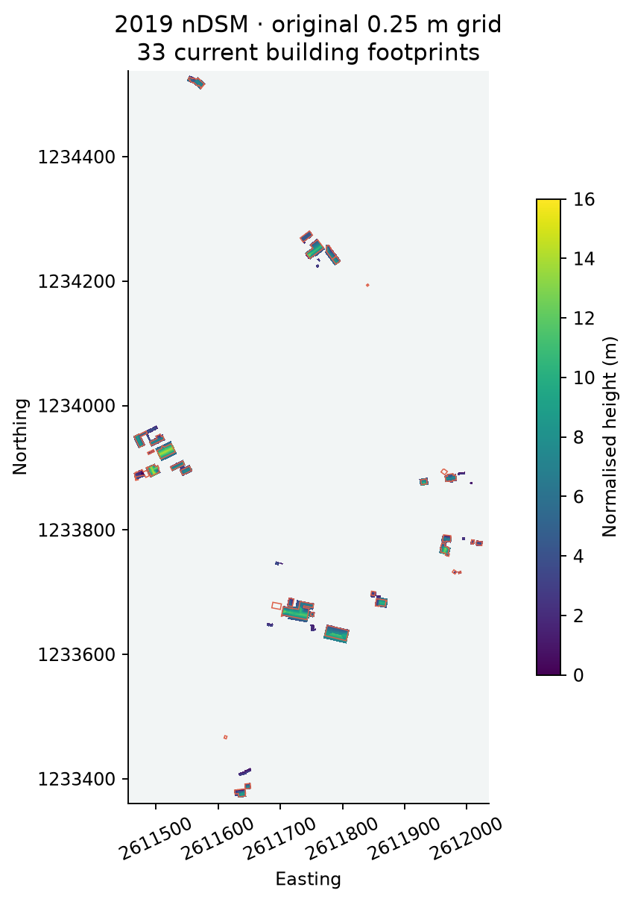

[All raster tutorials](raster-processing.qmd) · [Vector Raster plugin](../plugins.qmd#vector-raster)

Read the local 2019 nDSM, inspect its metadata and write a lossless GeoTIFF or Cloud Optimized GeoTIFF (COG).

## Before you begin

[Set up the complete raster project](raster-processing.qmd#set-up-the-example-project-once). Tested on **3 October 2026**, Apache Hop **2.19.0**, Java **21.0.10**, with the plugin builds recorded in the ZIP's `tested-environment.json`. Use the **local** run configuration.

[Download read-write-geotiff.hpl](../downloads/raster-processing/read-write-geotiff.hpl) · [Download read-write-cog.hpl](../downloads/raster-processing/read-write-cog.hpl)

[Complete project ZIP](../downloads/raster-processing.zip). Individual pipelines need the data and metadata from that ZIP.

{fig-alt="GeoTIFF pipeline in Hop GUI."}

## Read and inspect

1. Open `read-write-geotiff.hpl`.
2. Click **Read nDSM → Edit**. Select **Value / Variable**, source `${PROJECT_HOME}/data/ndsm-2019.tif`, output field `raster`.
3. Open **Inspect raster**. Keep the input field `raster`, prefix `info_` and metadata selection `width height crs bands`.

{fig-alt="Raster Reader using the bundled nDSM."}
{fig-alt="Raster Info adds metadata without creating a row for each pixel."}

## Configure the writer

| Setting | GeoTIFF pipeline | COG pipeline |
|---|---|---|
| Input raster field | `raster` | `raster` |
| Output path | `${PROJECT_HOME}/output/read-write-geotiff.tif` | `${PROJECT_HOME}/output/read-write-cog.tif` |
| Output format | `GEOTIFF` | `COG` |
| Compression | `Deflate` | `Deflate` |
| Add overviews | On | Controlled by COG format |
| Internal overviews / resampling | `AUTO` / `AVERAGE` | `AUTO` / `AVERAGE` |
| Overwrite / result prefix | Off / `out_` | Off / `out_` |

{fig-alt="GeoTIFF Writer with lossless compression and internal overviews."}
{fig-alt="COG Writer settings in Hop GUI."}

## Run and check

Run each pipeline once. Each processes **one row**, representing the entire raster. **Remove raster value** removes the typed raster from the final row, leaving inspectable metadata and writer status.

Expect 2322 × 4709 pixels, one Float32 band, EPSG:2056 and NoData `-9999`. The full-resolution values and georeferencing match the input exactly. Both outputs have internal overviews; the COG additionally uses a layout suitable for HTTP range access. The COG structure was independently validated with GDAL.

{fig-alt="Successful GeoTIFF run with one raster row."}
{fig-alt="Actual nDSM output and the 33 building footprints."}

## Things to watch out for

- Metadata fields describe the raster; they do not expose every pixel as a Hop row.
- Use distinct prefixes for Info (`info_`) and Writer (`out_`) to prevent field collisions.
- `Deflate` preserves numeric samples. JPEG is lossy and is unsuitable for this Float32 height raster.
- Overview resampling affects the reduced-resolution images, not the full-resolution raster.
- A local COG becomes remotely readable only when its server correctly supports HTTP range requests.
- Existing files are protected. Change the path or remove only the generated output before repeating a run.

## Further reading

- [Relevant handbook section (German)](https://edigonzales.github.io/hop-vector-raster-plugin/benutzerhandbuch/main/index.html#raster-writer)
- [Plugin and repository examples](https://github.com/edigonzales/hop-vector-raster-plugin/tree/main/examples)
