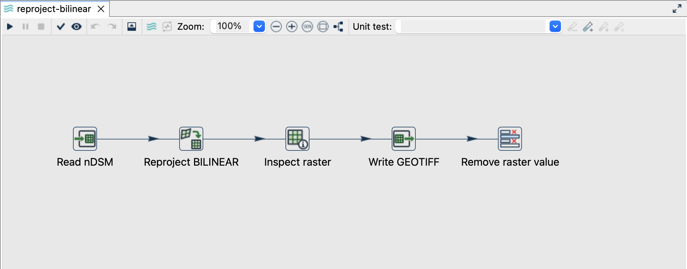
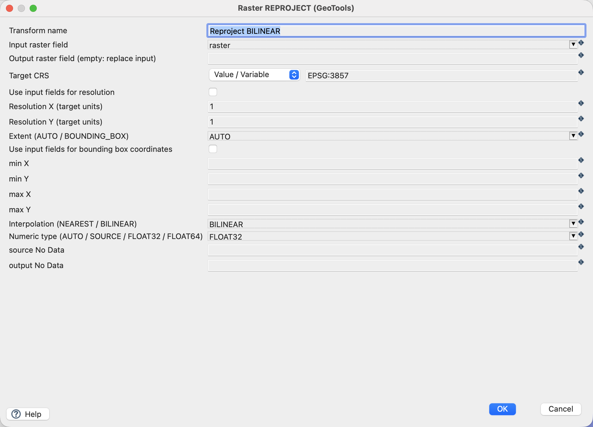
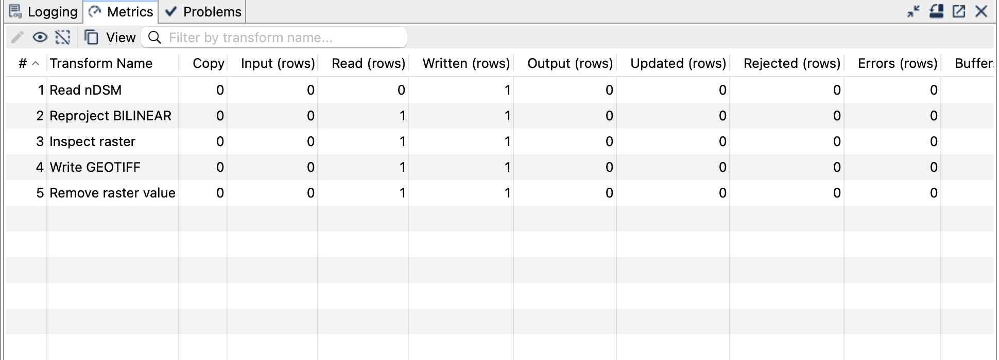
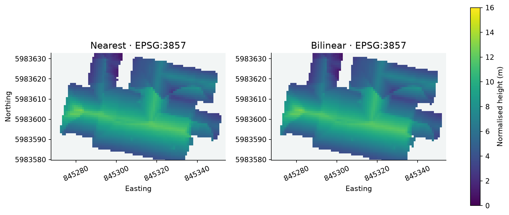

[All raster tutorials](raster-processing.qmd) · [Vector Raster plugin](../plugins.qmd#vector-raster)

Transform the grid from LV95 to Web Mercator and compare nearest-neighbour sampling with bilinear interpolation.

## Before you begin

[Set up the complete raster project](raster-processing.qmd#set-up-the-example-project-once). Tested on **3 October 2026**, Apache Hop **2.19.0**, Java **21.0.10**, with the plugin builds recorded in the ZIP's `tested-environment.json`. Use the **local** run configuration.

[Download reproject-nearest.hpl](../downloads/raster-processing/reproject-nearest.hpl) · [Download reproject-bilinear.hpl](../downloads/raster-processing/reproject-bilinear.hpl)

[Complete project ZIP](../downloads/raster-processing.zip). Individual pipelines need the data and metadata from that ZIP.

{fig-alt="Read, reproject, inspect and write the raster."}

## Configure Reproject

1. Open either pipeline. **Read nDSM** reads the same bundled input.
2. Open **Reproject NEAREST** or **Reproject BILINEAR**. These pipelines differ in interpolation and output filename.
3. Use the settings below. The output raster field remains empty, replacing the input value.

| Setting | Value |
|---|---|
| Input raster field | `raster` |
| Target CRS | `EPSG:3857` |
| Resolution X / Y | `1` / `1` |
| Extent | `AUTO` |
| Interpolation | `NEAREST` or `BILINEAR` |
| Numeric type | `FLOAT32` |
| Source/output NoData overrides | Empty: inherit `-9999` |
| Writer outputs | `output/reproject-nearest.tif`, `output/reproject-bilinear.tif` |

{fig-alt="Raster Reproject with explicit target CRS, resolution and interpolation."}

## Run and compare

Each pipeline writes one **858 × 1740** Float32 raster. Both use EPSG:3857, 1-unit pixels and the same extent: E 844908–845766, N 5983148–5984888. Cell boundaries are aligned to target-resolution multiples; `AUTO` rounds the transformed footprint outwards.

Nearest selects a source sample and is appropriate when class codes must remain intact. Bilinear combines up to four source neighbours and gives smoother continuous heights; invalid neighbours are excluded and the remaining weights normalised. It does **not** calculate an area average of all source pixels covered by a larger target cell.

{fig-alt="Successful reprojection and resampling run."}
{fig-alt="Actual nearest-neighbour and bilinear output crops on the same target grid."}

## Things to watch out for

- These are Web Mercator map metres, not uniformly accurate ground metres. Use LV95 for local measurements and the original raster for the building statistics.
- Explicitly set both resolutions. Assigning a CRS elsewhere does not perform this operation.
- Resampling can change extrema and the number of valid samples. It is deliberately absent from the ZonalStats examples.
- The check uses independent PROJ sampling with a bounded 6.25-cm source-coordinate tolerance because this GeoTools build and PROJ differ by about 4 cm for the datum operation. Controlled same-CRS fixtures check interpolation separately.
- Preserve NoData; do not replace it with zero as a convenience.

## Further reading

- [Relevant handbook section (German)](https://edigonzales.github.io/hop-vector-raster-plugin/benutzerhandbuch/main/index.html#raster-reproject)
- [Plugin and repository examples](https://github.com/edigonzales/hop-vector-raster-plugin/tree/main/examples)
