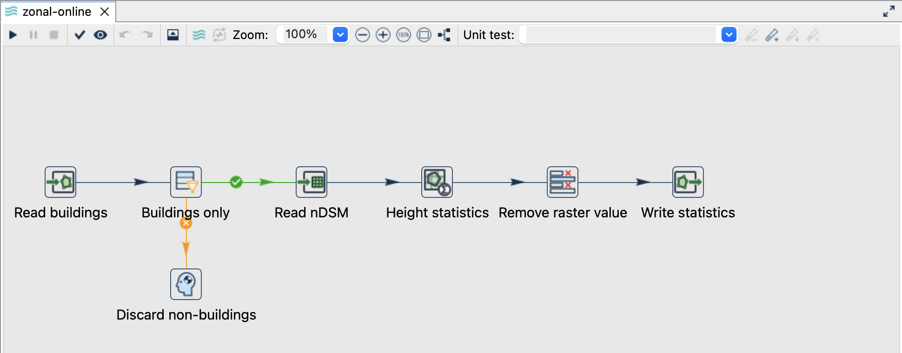
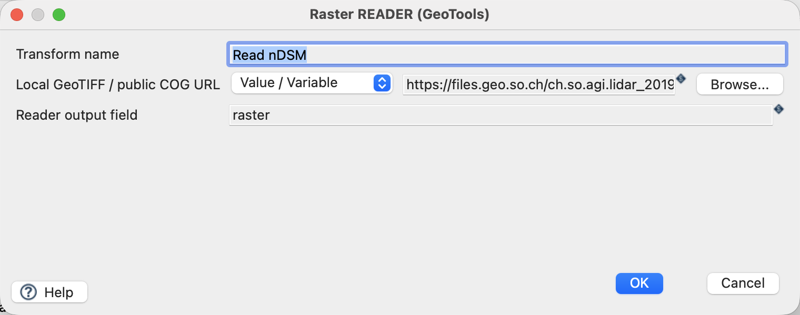
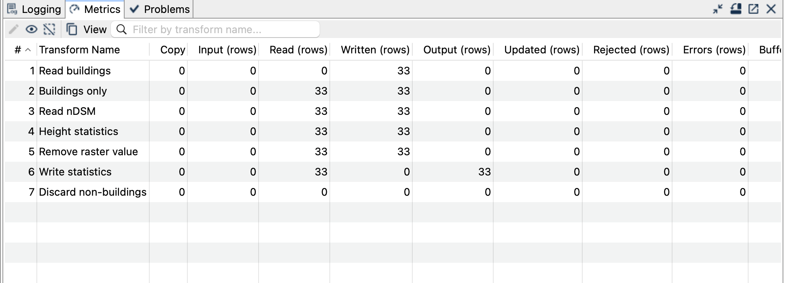

[All raster tutorials](raster-processing.qmd) · [Vector Raster plugin](../plugins.qmd#vector-raster)

Repeat the building-only analysis with direct range reads from the public 2019 nDSM. The polygons remain local.

## Before you begin

[Set up the complete raster project](raster-processing.qmd#set-up-the-example-project-once). Tested on **3 October 2026**, Apache Hop **2.19.0**, Java **21.0.10**, with the plugin builds recorded in the ZIP's `tested-environment.json`. Use the **local** run configuration.

[Download zonal-online.hpl](../downloads/raster-processing/zonal-online.hpl)

[Complete project ZIP](../downloads/raster-processing.zip). Individual pipelines need the data and metadata from that ZIP.

{fig-alt="Building statistics with the public 2019 nDSM source."}

## Change the source, keep the analysis

1. Complete the [local zonal tutorial](raster-zonal.qmd) first to understand the fields and expected result.
2. Open `zonal-online.hpl`. The local `buildings` layer and the explicit `art_txt = Gebaeude` filter are unchanged.
3. Open **Read nDSM**. Its **Value / Variable** source is the URL below; the output field is `raster`.

```text
https://files.geo.so.ch/ch.so.agi.lidar_2019.ndsm_buildings/aktuell/ch.so.agi.lidar_2019.ndsm_buildings.tif
```

{fig-alt="Raster Reader uses the explicitly selected public 2019 nDSM URL."}

ZonalStats uses `raster`, `geometrie`, explicit CRS `EPSG:2056`, band `1`, statistics `mean min max` and prefix `height_`, exactly as in the local example. No other land-cover categories enter the analysis. The output is `${PROJECT_HOME}/output/zonal-online.gpkg`, layer `building_heights`.

## Run and check

Run with an internet connection. The complete remote TIFF is about **2.64 GB**, but the reader requests relevant byte ranges rather than downloading the whole file. The server must respond with HTTP **206 Partial Content** and a matching `Content-Range`.

The checked online run produced **33 records: 29 OK and four NO_VALID_PIXELS**. All statistics, attributes and geometries matched the local example. Match by `building_id` or `T_Ili_Tid`, not by result row order.

{fig-alt="Successful online analysis of the same 33 buildings."}

## Things to watch out for

- This example uses **ch.so.agi.lidar_2019.ndsm_buildings**. A different acquisition or a non-normalised DSM changes the meaning of the results.
- The `/aktuell/` URL can change independently of the fixed local sample. The ZIP records retrieval metadata and checksums; future online values may differ.
- Public HTTP/HTTPS COGs are supported. There are no dialog fields for authentication or custom headers.
- A server returning a whole-file HTTP 200 response is not a valid range server for this reader. There is no full-download fallback.
- Network errors must fail the pipeline, not become successful zero-count results. The local variant remains usable offline.
- Preserve the output on failure for inspection, then remove only that generated file before retrying with the same path.

## Further reading

- [Relevant handbook section (German)](https://edigonzales.github.io/hop-vector-raster-plugin/benutzerhandbuch/main/index.html#raster-cog)
- [Plugin and repository examples](https://github.com/edigonzales/hop-vector-raster-plugin/tree/main/examples)
