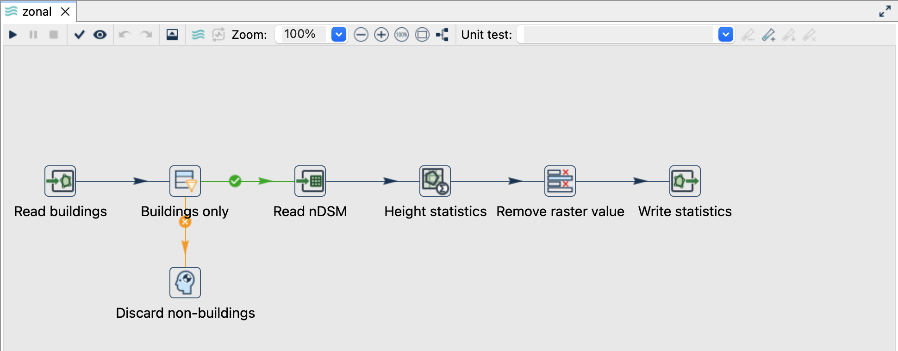
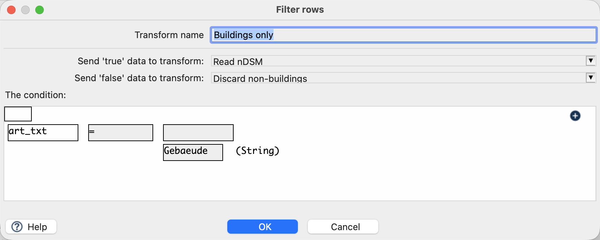
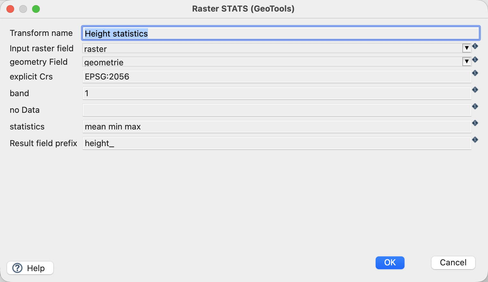
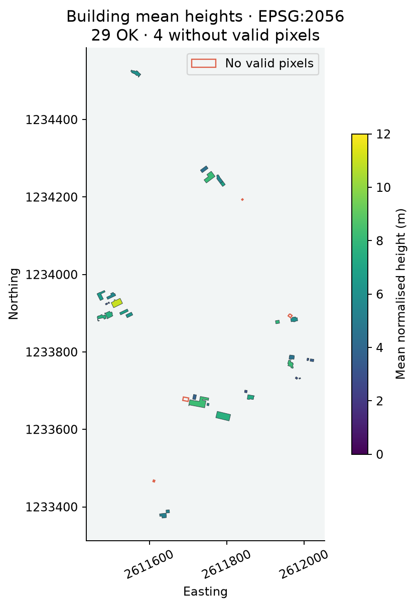

[All raster tutorials](raster-processing.qmd) · [Vector Raster plugin](../plugins.qmd#vector-raster)

Calculate mean, minimum and maximum normalised height for buildings only, using the fixed local crop of the 2019 nDSM.

## Before you begin

[Set up the complete raster project](raster-processing.qmd#set-up-the-example-project-once). Tested on **3 October 2026**, Apache Hop **2.19.0**, Java **21.0.10**, with the plugin builds recorded in the ZIP's `tested-environment.json`. Use the **local** run configuration.

[Download zonal.hpl](../downloads/raster-processing/zonal.hpl)

[Complete project ZIP](../downloads/raster-processing.zip). Individual pipelines need the data and metadata from that ZIP.

{fig-alt="Building-only zonal statistics followed by GeoPackage output."}

## Follow the pipeline

1. Open `zonal.hpl`. **Read buildings** reads `${PROJECT_HOME}/data/buildings.gpkg`, layer `buildings`, geometry field `geometrie`.
2. **Buildings only** checks `art_txt = Gebaeude`; its false branch discards non-building rows. The input file already contains only buildings.
3. **Read nDSM** adds `${PROJECT_HOME}/data/ndsm-2019.tif` as `raster` to each row. There is no preceding reprojection or resampling.
4. **Height statistics** reads the raster and the corresponding footprint.
5. **Remove raster value** removes `raster` while keeping attributes, geometry and statistics. **Write statistics** creates `${PROJECT_HOME}/output/zonal.gpkg`, layer `building_heights`.

{fig-alt="The explicit Gebaeude filter safeguards the building-only analysis."}

## Configure ZonalStats

| Setting | Value |
|---|---|
| Input raster field | `raster` |
| Geometry field / explicit CRS | `geometrie` / `EPSG:2056` |
| Band | `1` |
| Statistics | `mean min max` |
| Prefix | `height_` |
| NoData override | Empty: source declares `-9999` |

{fig-alt="Raster ZonalStats settings for normalised building heights."}

## Run and inspect the result

Expect **33 building polygons** with original attributes and `building_id`, plus `height_mean`, `height_min`, `height_max`, `height_count` and `height_status`. The writer may allocate its own storage feature IDs; use `building_id` or `T_Ili_Tid` for matching records.

For the bundled snapshot, **29 buildings are OK and four have NO_VALID_PIXELS**. Example independently checked records:

| building_id | count | mean (m) | min (m) | max (m) | status |
|---|---|---|---|---|---|
| 15 | 0 | null | null | null | NO_VALID_PIXELS |
| 16 | 2717 | 5.637887 | 0.383500 | 7.887500 | OK |
| 17 | 3570 | 6.543541 | 2.833000 | 9.418750 | OK |
| 20 | 12603 | 8.220402 | 3.047500 | 13.105294 | OK |

{fig-alt="Successful run of the 33 building records."}
{fig-alt="Actual mean-height results; outlined buildings without valid pixels remain in the output."}

## Things to watch out for

- A pixel contributes when its **centre is covered by the polygon**, including centres on the boundary. This is not ALL_TOUCHED or an area-weighted statistic.
- NoData, masked and non-finite samples are excluded; a valid zero is included.
- The current footprints and the 2019 acquisition can disagree. Null statistics are an explicit result, not a technical failure or an assumed zero height.
- The output describes nDSM samples inside a footprint, not an exact building or roof height.
- Keep the typed Raster field away from Vector Writer by removing it with Select Values.
- Rerunning must use a fresh destination or remove only the generated `zonal.gpkg`.

## Further reading

- [Relevant handbook section (German)](https://edigonzales.github.io/hop-vector-raster-plugin/benutzerhandbuch/main/index.html#raster-statistik)
- [Plugin and repository examples](https://github.com/edigonzales/hop-vector-raster-plugin/tree/main/examples)
