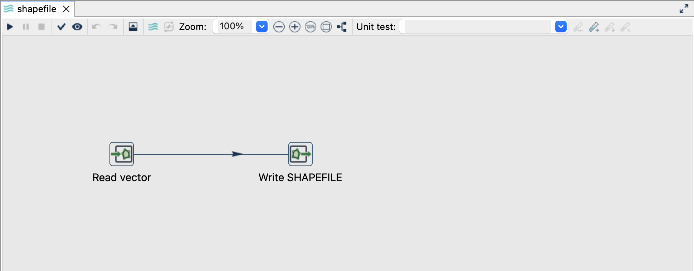
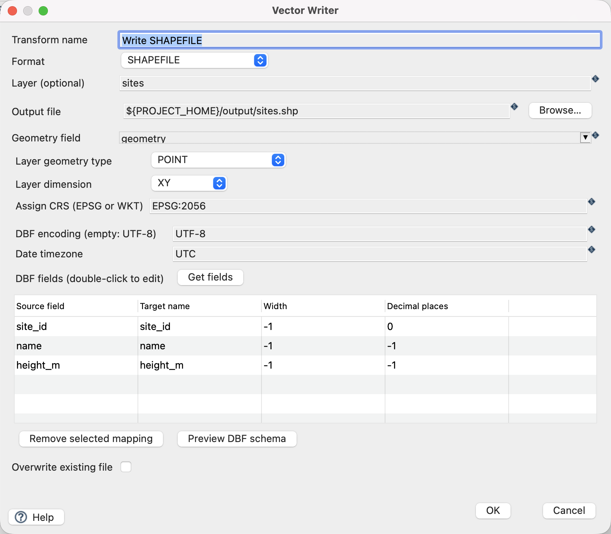
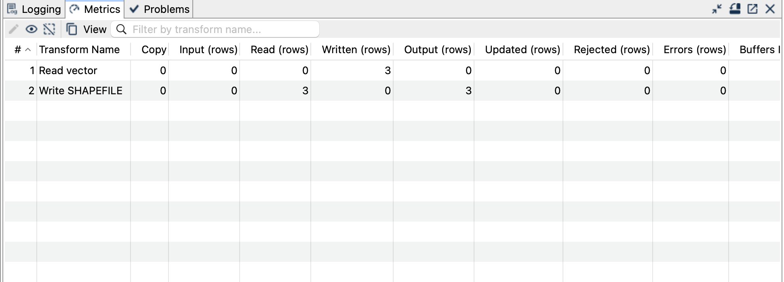

[All vector examples](../examples.qmd) · [Vector Raster plugin](../plugins.qmd#vector-raster)

Export the three sites as an ESRI Shapefile while preserving the names and numeric attributes. Then read the generated file back through Vector Reader.

## Before you begin

[Download and set up the example project](../examples.qmd#set-up-the-example-project-once). This walkthrough uses Apache Hop ****, distribution ****, with the **local** run configuration. Keep the supplied input unchanged and use a writable `output` directory.

[Download shapefile.hpl](../downloads/vector-formats/shapefile.hpl) · [Complete project ZIP](../downloads/vector-formats.zip)

The individual pipeline requires the data and project configuration from the complete ZIP.

{fig-alt="The Shapefile pipeline in Hop GUI."}

## Read the source

1. Open **`shapefile.hpl`** from the example project.
2. Click **Read vector** and choose **Edit**. The file is `${PROJECT_HOME}/data/sites.gpkg`, format `AUTO`, layer `sites`, and geometry output field `geometry`.
3. Use the source schema/preview controls to inspect the fields. Expect `site_id`, `name`, `height_m` and a geometry field. The source contains three point features in EPSG:2056.
4. Close the reader dialog with **OK**, then click the writer and choose **Edit**.

{fig-alt="Vector Reader configured for the supplied GeoPackage layer."}

## Configure the writer

| Setting | Value |
|---|---|
| Format | `SHAPEFILE` |
| Output file | `${PROJECT_HOME}/output/sites.shp` |
| Geometry field | `geometry` |
| Layer geometry type | `POINT` |
| Layer dimension | `XY` |
| Assign CRS | `EPSG:2056` |
| DBF encoding | `UTF-8` |
| Overwrite existing file | `Off` |

{fig-alt="Vector Writer settings for Shapefile."}

## Run and check the result

Click **Get fields** in the DBF section to inspect mappings, then **Preview DBF schema**. The supplied names (`site_id`, `name`, `height_m`) fit the DBF name limit; keep the inferred widths for these small values. Preview the schema whenever your real data has longer names or large numeric values.

Save and run. Expect three features and several files with the `sites` stem: the geometry, index, attribute table, CRS and encoding files together form the dataset.

Open and run `read-shapefile.hpl`. Its reader uses `${PROJECT_HOME}/output/sites.shp`; its writer creates `output/shapefile-readback.gpkg`. Verify three points, `Brücke` and the three height values in the output.

{fig-alt="Completed Shapefile pipeline with processing metrics."}

## Things to watch out for

- Share all Shapefile sidecars together, not just `.shp`. Keep their basenames identical.
- DBF field names are limited to ten characters. Shortening and character replacement may change names; explicit mappings and the schema preview make the result predictable.
- Width and decimal settings can truncate text or round numbers. Check the result against the source before distributing it.
- Curves are linearized; choose a suitable geometry family and dimension. This tutorial uses XY points only.
- There is no append/update mode here. Before repeating, choose a new stem or remove all generated sidecars for `sites` from `output`.

The CRS controls assign a coordinate reference system; they do not reproject coordinates. All coordinates in this example already use EPSG:2056.

## Further reading

- [Format reference (German)](https://edigonzales.github.io/hop-vector-raster-plugin/benutzerhandbuch/main/index.html#shapefile)
- [Vector Writer settings (German)](https://edigonzales.github.io/hop-vector-raster-plugin/benutzerhandbuch/main/index.html#vector-writer)
- [Plugin source and additional examples](https://github.com/edigonzales/hop-vector-raster-plugin/tree/main/examples)
